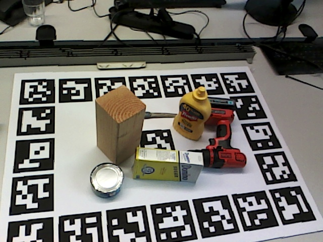
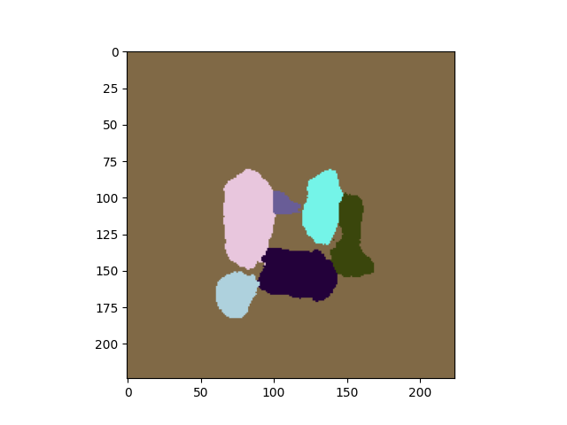

# YCBM_seg
Performs pixel level segmentation on RGB images to find YCB-Video/YCBM classes
Uses Mobilenet for feature extraction
Network Structure based on [PoseCNN](https://arxiv.org/pdf/1711.00199.pdf)
Obtains pixel level (not IoU) mAR of 67% mAP 64% Dice 85%

## Training

### Running
python(3) scripts/TwoD_Seg.py [path to training directory] [path to validation directory] [path for model checkpoints] [--optional args]
### Directory Structure
```

└───Train/Val
│   │
│   └───Camera Type 1
|   |   └───Session A
│   |   │   |   000001.jpg (RGB)
│   |   │   |   000001.seg.png (Seg ground truth)
│   |   │   ...
|   |   |  
|   |   └───Session B
│   |   │   |   000001.jpg (RGB)
│   |   │   |   000001.seg.png (Seg ground truth)
│   |   │   ...
|   |   └───Session ...
|   └───Camera Type 2
|   |   └───Session C
|   └───Camera Type ...
```

## Running
`python3 main.py path_to_model path_to_image_dir`
will save results in out_segs.

A few reference images and outputs are provided in `images` and `ref_segs` for ease of evaluation

Model weights are available at TBD

## Examples



